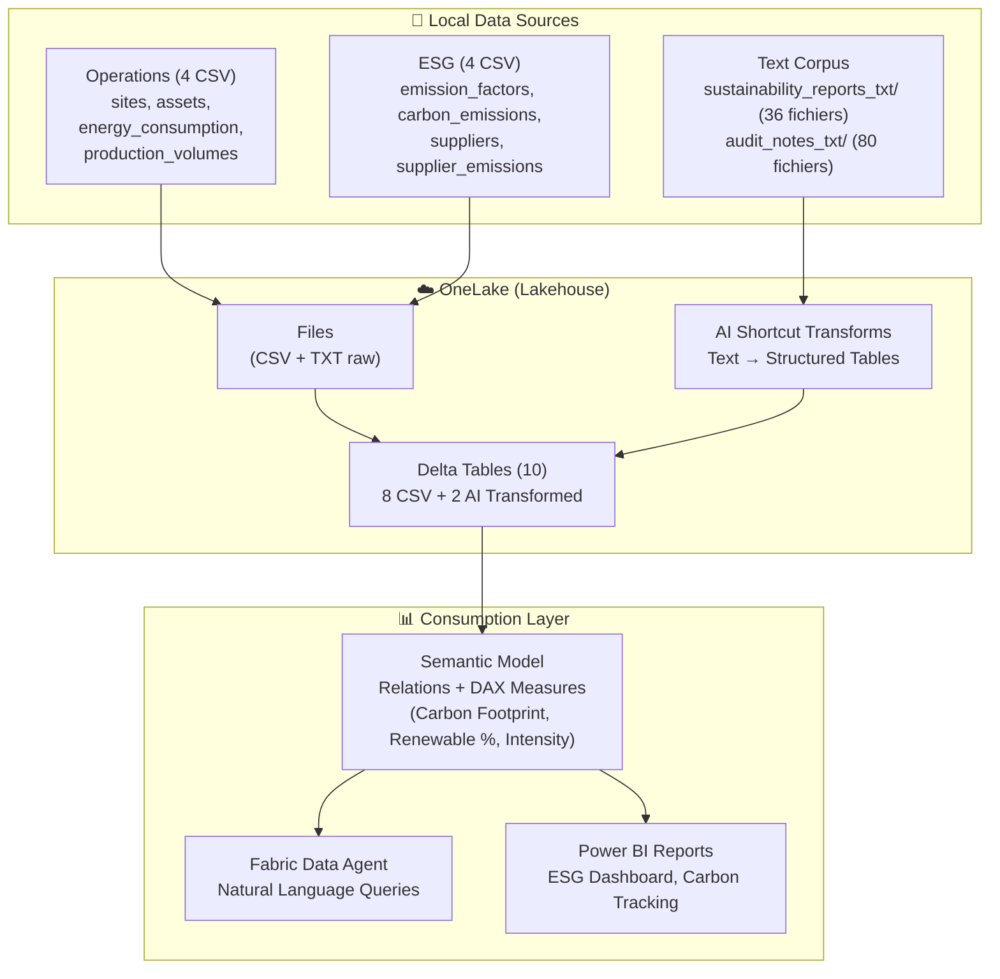

# ESG & Carbon Analytics - Microsoft Fabric Demo

Démo complète Microsoft Fabric illustrant **OneLake**, **Shortcuts**, **AI Transformations**, et **Fabric Data Agent** avec un cas d'usage **ESG & Carbon Analytics** (Scope 1/2/3, Renewable Energy, Supplier Risk).

---

## 🎯 Objectif

Démontrer Microsoft Fabric avec :
- **8 tables relationnelles** (Operations + ESG)
- **2 corpus texte** (sustainability reports + audit notes)
- **Analyses carbone** (Scope 1/2/3, émissions par site/produit)
- **AI Transformations** (extraction insights des rapports texte)
- **Data Agent** pour questions ESG en langage naturel

---

## 📐 Architecture



---

## 📊 Données Générées

### Tables Operations (4)
| Table | Lignes | Description |
|-------|--------|-------------|
| `sites` | 12 | Sites opérationnels (manufacturing, warehouse, office) |
| `assets` | ~250 | Équipements (production lines, HVAC, lighting, IT) |
| `energy_consumption` | ~1 300 | Consommation mensuelle par site et source d'énergie |
| `production_volumes` | ~180 | Volumes de production mensuels (manufacturing uniquement) |

### Tables ESG (4)
| Table | Lignes | Description |
|-------|--------|-------------|
| `emission_factors` | ~10 | Facteurs d'émission (kg CO₂/kWh par région et source) |
| `carbon_emissions` | ~3 900 | Émissions carbone Scope 1 & 2 par site et mois |
| `suppliers` | 80 | Fournisseurs avec ESG rating et spend |
| `supplier_emissions` | ~240 | Émissions Scope 3 par fournisseur et année |

### Corpus Texte (2)
| Corpus | Fichiers | Description |
|--------|----------|-------------|
| `sustainability_reports_txt/` | 36 | Rapports annuels de durabilité par site (2023-2025) |
| `audit_notes_txt/` | 80 | Notes d'audit ESG (positive, neutral, negative findings) |

**Total** : 8 tables + 2 corpus texte = **10 sources de données** + **~6 000 lignes CSV** + **116 fichiers texte**

---

## 🚀 Quick Start

### 1. Générer les Données

```powershell
# Cloner le repo et installer les dépendances
cd "Scenario 5 - ESG\src"
pip install -r ..\requirements.txt

# Générer les données
python generate_data.py
```

**Sortie attendue** :
```
✅ Génération terminée avec succès!
📊 Statistiques:
  - Sites: 12
  - Assets: 250
  - Enregistrements énergie: 1 300+
  - Émissions carbone: 3 900+
  - Fournisseurs: 80
  - Rapports durabilité: 36 fichiers
  - Notes d'audit: 80 fichiers
```

**Fichiers générés** :
- `data/raw/operations/` : 4 fichiers CSV
- `data/raw/esg/` : 4 fichiers CSV
- `data/raw/text/sustainability_reports_txt/` : 36 fichiers .txt
- `data/raw/text/audit_notes_txt/` : 80 fichiers .txt

### 2. Déployer dans Microsoft Fabric

Suivre le guide [`docs/fabric_setup.md`](docs/fabric_setup.md) :
1. Créer un Lakehouse
2. Uploader les CSV + fichiers texte via OneLake
3. Appliquer AI Transformations sur les rapports texte
4. Créer des tables Delta
5. Créer un Semantic Model avec relations
6. Configurer le Data Agent

### 3. Tester le Data Agent

Poser des questions en langage naturel :
- *"Quels sites dépassent nos objectifs carbone 2025 ?"*
- *"Où agir en priorité pour réduire le Scope 3 ?"*
- *"Résume les audits avec findings négatifs"*
- *"Quelle est notre intensité carbone par unité produite ?"*

Voir [`docs/questions_demo.md`](docs/questions_demo.md) pour 20+ exemples.

---

## 📈 Cas d'Usage ESG

### 1. Carbon Footprint Analysis (Scope 1/2/3)
- Émissions totales par scope
- Émissions par site / région
- Émissions par source d'énergie
- Intensité carbone (kg CO₂ par unité produite)

### 2. Renewable Energy Tracking
- % d'énergie renouvelable par site
- Évolution vs objectifs (35% en 2024, 50% en 2025)
- Impact sur les émissions Scope 2

### 3. Target Compliance
- Comparaison vs objectifs de réduction (baseline 2023)
- Sites en dépassement vs sur la bonne voie
- Forecasting pour atteindre net-zero

### 4. Supplier ESG Risk
- Fournisseurs à fort impact Scope 3
- Analyse par ESG rating (A/B/C/D)
- Identification fournisseurs à risque

### 5. AI-Powered Insights
- Extraction insights des rapports de durabilité
- Détection findings d'audit négatifs
- Sentiment analysis sur performance ESG

---

## 🎬 Scénarios Métier Intégrés

### Scénario 1 : Renewable Energy Ramp-Up
**Objectif** : Augmenter la part d'énergie renouvelable  
**Timeline** : 2023 (25%) → 2024 (35%) → 2025 (50%)  
**Impact** : Réduction Scope 2 de -15%

### Scénario 2 : Scope 3 Supplier Risk
**Enjeu** : 10 fournisseurs problématiques (ESG rating D)  
**Impact** : 2.5× les émissions normales  
**Action** : Engagement fournisseurs, switch vers alternatives A/B rated

### Scénario 3 : Site Performance Variance
**Best performers** : SITE_001, SITE_006 (-15% consommation)  
**Underperformers** : SITE_004, SITE_009 (+25% consommation)  
**Analyse** : Identifier best practices, déployer sur sites en difficulté

---

## 🔧 Configuration Avancée

### Modifier les Objectifs ESG

Éditer [`src/config.yaml`](src/config.yaml) :

```yaml
targets:
  2025:
    scope1_reduction_pct: 0.20  # Passer à -20% au lieu de -12%
    renewable_energy_pct: 0.60  # 60% au lieu de 50%
```

### Activer/Désactiver les Scénarios

```yaml
scenarios:
  renewable_energy_ramp:
    enabled: false  # Désactiver
  
  scope3_suppliers_risk:
    high_risk_count: 15  # Augmenter à 15 fournisseurs
```

Puis relancer :
```bash
python src/generate_data.py
```

---

## 📚 Documentation

| Document | Description |
|----------|-------------|
| [`schema.md`](docs/schema.md) | Schéma détaillé des 10 tables |
| [`demo_story.md`](docs/demo_story.md) | Scénario narratif responsable ESG |
| [`fabric_setup.md`](docs/fabric_setup.md) | Guide de déploiement Fabric |
| [`questions_demo.md`](docs/questions_demo.md) | 20+ questions Data Agent |
| [`data_agent_instructions.md`](docs/data_agent_instructions.md) | System prompt Data Agent |
| [`data_agent_examples.md`](docs/data_agent_examples.md) | Exemples Q&A détaillés |

---

## 🎯 KPIs ESG Démontrables

### Carbon Metrics
- **Total Emissions** (tonnes CO₂) : Scope 1 + Scope 2 + Scope 3
- **Scope 1** : Combustion directe (natural gas, diesel)
- **Scope 2** : Électricité achetée (grid mix)
- **Scope 3** : Fournisseurs (purchased goods & services)
- **Carbon Intensity** : kg CO₂ / unité produite

### Energy Metrics
- **Total Energy Consumption** (kWh)
- **Renewable Energy %**
- **Energy Intensity** (kWh / unité produite)

### Progress Metrics
- **Reduction vs Baseline** (2023)
- **Target Achievement %**
- **Gap to Net-Zero**

### Supplier Metrics
- **Supplier ESG Rating Distribution**
- **High-Risk Suppliers Count**
- **Scope 3 Contribution by Supplier**

---

## 🧮 Formules DAX Clés

### Total Emissions
```dax
Total Emissions (tonnes CO₂) = 
SUM(carbon_emissions[emissions_tonnes_co2]) + 
SUM(supplier_emissions[emissions_tonnes_co2])
```

### Renewable Energy %
```dax
Renewable Energy % = 
DIVIDE(
    SUM(energy_consumption[renewable_kwh]),
    SUM(energy_consumption[consumption_kwh]),
    0
) * 100
```

### Carbon Intensity
```dax
Carbon Intensity (kg CO₂/unit) = 
DIVIDE(
    SUM(carbon_emissions[emissions_kg_co2]),
    SUM(production_volumes[units_produced]),
    0
)
```

### Reduction vs Baseline
```dax
Reduction vs 2023 % = 
VAR CurrentEmissions = [Total Emissions (tonnes CO₂)]
VAR BaselineEmissions = CALCULATE([Total Emissions (tonnes CO₂)], year = 2023)
RETURN
DIVIDE(
    CurrentEmissions - BaselineEmissions,
    BaselineEmissions,
    0
) * 100
```

Voir [`docs/fabric_setup.md`](docs/fabric_setup.md) pour toutes les mesures DAX.

---

## 🚨 Prérequis

- **Python 3.8+**
- **Librairies** : `pyyaml` (voir `requirements.txt`)
- **Microsoft Fabric** : Licence trial ou payante
- **Espace OneLake** : ~50 MB

---

## 🔐 Données Fictives

**Toutes les données sont 100% fictives** :
- Sites et fournisseurs générés aléatoirement
- Émissions simulées (pas de vraies données carbone)
- Utilisable librement pour formation/démo

---

## 🌍 Contexte ESG

Cette démo s'inscrit dans les enjeux :
- **CSRD** (Corporate Sustainability Reporting Directive)
- **GHG Protocol** (Greenhouse Gas Protocol)
- **SBTi** (Science Based Targets initiative)
- **Net-Zero commitments**

---

## 🤝 Contributeurs

Créé pour démonstrations Microsoft Fabric.

---

## 📝 Licence

Données fictives - Utilisation libre pour démos et formations.

---

**Happy sustaining! 🌱📊**

*Ce repo démontre la puissance de Microsoft Fabric pour les équipes ESG et Sustainability.*
